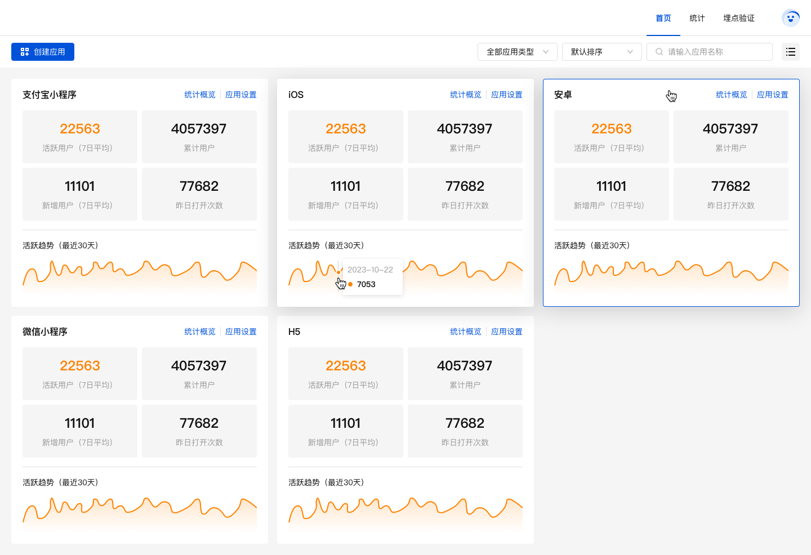
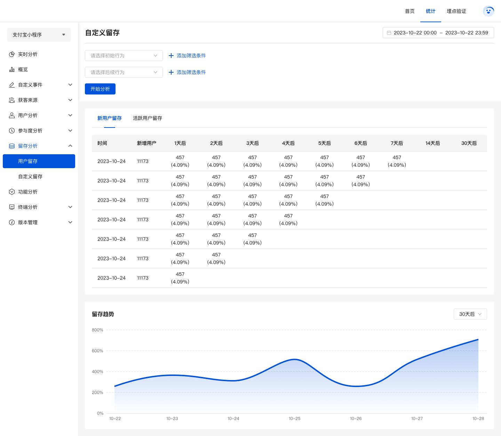
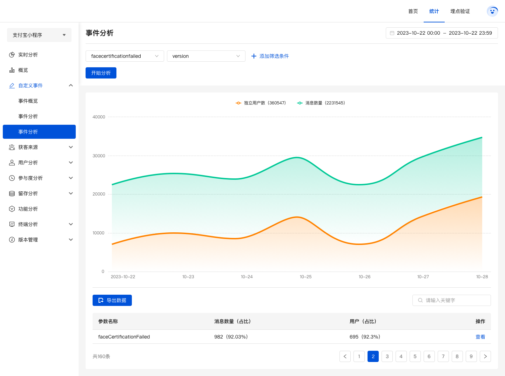

# analytics-admin-server

基于 Nest + TypeScript 进行开发

## 联系我们

联系我们，给您最优的服务，欢迎访问 [openhn官网](https://www.openhn.com) 


## 前言

全平台（iOS、Android、小程序、web）SDK支持，极简无侵入式接入
一键私有化部署服务，数据完全掌控在您手中
支持日亿级别日志量，洞察大数据背后的秘密

## 功能

-   [x] 实时分析
-   [x] 数据概览
-   [x] 事件概览
-   [x] 事件明细
-   [x] 事件分析
-   [x] 用户统计
-   [x] 启动次数
-   [x] 用户路径
-   [x] 使用时长
-   [x] 用户留存
-   [x] 自定义留存
-   [x] 分辨率
-   [x] ...

## 安装步骤
**开发环境准备**
- 基于 docker 容器化技术进行开发，请先[下载安装 docker](https://docs.docker.com/get-docker/)
- 安装 [docker-compose](https://docs.docker.com/compose/)
- Node（18.18.2)
- 采用 [scripty](https://www.npmjs.com/package/scripty) 管理本项目的所有命令。所有的命令（shell 文件）定义在 `scripts`
  文件夹下。

**开发命令**


```sh
# 初始化服务
npm run bootstrap

# docker相关 
# up - docker-compose 后台启动所有服务（mysql/redis/clickhouse/kafka/zookeeper/ngnix/前端）
# stop - docker-compose 关闭
# restart - docker-compose 重启
npm run up
npm run stop
npm run restart 

# 启动 （服务端），本地环境-配置文件 dist/config/config.development.js
npm run start

# 启动 （服务端），测试环境-配置文件 dist/config/config.test.js
npm run start:test

# 启动 （服务端），生产环境-配置文件 dist/config/config.prod.js
npm run start:prod
```

## docker-compose 一键部署
```sh
# amd64架构(intel芯片)
docker-compose -f docker-compose.yml up -d
# arm64架构(apple m系列芯片)
docker-compose -f docker-compose-arm64.yml up -d
```

## 本地验证
1. 浏览器输入ip地址，可访问后管并初始化管理员账号。以本地搭建举例：http://localhost
2. 各平台前端sdk初始化host参数为 $ip/app。以本地搭建举例：http://localhost/app

## 项目截图

### 首页



### 实时分析


### 留存



## 事件分析

